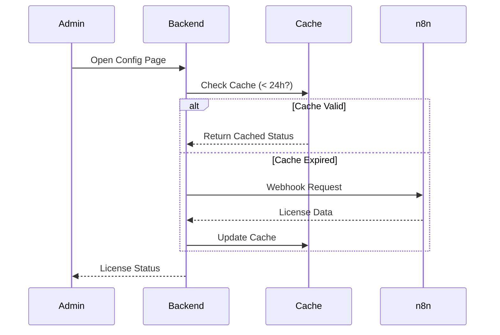

# 🚀 Hero Blocks

<div align="center">


**Professional CMS Blocks for Shopware Shopping Experiences**

_More Conversion. Less Code._

[Features](#-features) • [Installation](#-installation) • [CLI Tool](#-cli-tool) • [Documentation](#-documentation) • [Support](#-support)

</div>

---

## ✨ Features

| Block                           | Category   | Description                                                               |
| ------------------------------- | ---------- | ------------------------------------------------------------------------- |
| 🎠 **Hero Block Slider**        | Image      | Multi-slide hero slider with navigation, auto-play, and per-slide styling |
| 📐 **Hero Two Columns**         | Text-Image | Image & text layout with parallax scrolling effects                       |
| 🍔 **Hero Mega Menu**           | Sidebar    | Advanced mega menu navigation with products and widgets                   |
| 🏷️ **Hero Category Slider**     | Image      | Category slider with images and links                                     |
| 📸 **Hero Instagram Feed**      | Image      | Instagram API integration for dynamic feeds                               |
| 🎬 **Hero Video Extended**      | Video      | Video block with Intersection Observer for play/pause                     |
| ❓ **Hero FAQ**                 | Text       | FAQ accordion with Schema.org rich snippets                               |
| 📅 **Hero Timeline**            | Text-Image | Timeline block with year navigation                                       |
| 🛒 **Hero Shopping Experience** | Commerce   | Enhanced product detail pages                                             |
| 📋 **Hero Booking Form**        | Form       | Test ride & booking forms with model selection                            |
| 🔍 **Smart Magnifier**          | Feature    | Intelligent zoom lens with auto-enhancement after 1.5s hover              |

### Additional Features

- 🔐 **License Check System** - n8n-based license validation with 24h caching
- 🔄 **Auto-Update System** - Automatic updates via GitHub Releases
- 🎨 **Per-Slide Styling** - Individual colors for headlines, text, and buttons
- 📱 **Fully Responsive** - Mobile-first design with Bootstrap 5
- ⚡ **Performance Optimized** - Lazy loading, Intersection Observer, minimal JS
- 🔍 **Smart Magnifier** - Circular lens with Smart Zoom (64px → 96px, 4x → 7x zoom)
- 💀 **Skeleton Loaders** - Animated placeholders for perceived performance

---

## 📦 Installation

### Requirements

- Shopware 6.7+
- PHP 8.2+
- Node.js 18+

### Quick Start

```bash
# Activate plugin
docker exec horex-shopware php bin/console plugin:refresh
docker exec horex-shopware php bin/console plugin:install --activate HeroBlocks
docker exec horex-shopware php bin/console cache:clear
```

### Environment Configuration

Add to your `.env` file:

```env
HERO_BLOCKS_WEBHOOK_URL=https://your-n8n-instance.com/webhook/hero-blocks
```

---

## 🛠️ Development

### Build Commands

```bash
# Full build (Admin + Storefront)
./build.sh

# Admin only (faster for UI development)
./build.sh --admin-only

# Storefront only (theme compile)
./build.sh --storefront-only

# Force rebuild (required after Twig changes!)
./build.sh --force
```

### Manual Build

```bash
# Admin Assets
docker exec horex-shopware php bin/console bundle:dump
docker exec -e PROJECT_ROOT=/var/www/html \
           -e ADMIN_ROOT=/var/www/html/vendor/shopware/administration \
           -e SHOPWARE_ADMIN_BUILD_ONLY_EXTENSIONS=1 \
           -e VITE_MODE=production \
           -w /var/www/html/vendor/shopware/administration/Resources/app/administration \
           horex-shopware npm run build
docker exec horex-shopware php bin/console assets:install
docker exec horex-shopware php bin/console cache:clear

# Storefront
docker exec horex-shopware php bin/console theme:compile
docker exec horex-shopware php bin/console cache:clear
```

### Architecture

```
HeroBlocks/
├── src/
│   ├── HeroBlocks.php                    # Main Plugin Class
│   ├── Content/Cms/TypeDataResolver/     # CMS Data Resolvers
│   ├── Controller/
│   │   ├── Admin/                        # API Controllers (License, Update)
│   │   └── Storefront/                   # Storefront Controllers
│   ├── Service/                          # Business Logic Services
│   ├── Storefront/Twig/                  # Twig Extensions
│   └── Resources/
│       ├── app/
│       │   ├── administration/src/       # Admin UI (Vue.js 3)
│       │   │   ├── module/sw-cms/
│       │   │   │   ├── blocks/           # CMS Block Registration
│       │   │   │   │   ├── commerce/     # hero-product-landing, hero-shopping-experience
│       │   │   │   │   ├── form/         # hero-booking-form
│       │   │   │   │   ├── image/        # hero-block-slider, hero-category-slider, hero-instagram-feed
│       │   │   │   │   ├── sidebar/      # hero-mega-menu
│       │   │   │   │   ├── text/         # hero-faq
│       │   │   │   │   ├── text-image/   # hero-two-columns, hero-timeline
│       │   │   │   │   └── video/        # hero-video-extended
│       │   │   │   └── elements/         # CMS Element Configuration
│       │   │   └── snippet/              # Translations (de-DE, en-GB)
│       │   └── storefront/src/           # Storefront (JS + SCSS)
│       │       ├── smart-magnifier/      # Smart Magnifier Plugin
│       │       ├── hero-*/               # Block-specific JS Plugins
│       │       └── scss/components/      # SCSS Components
│       ├── config/                       # Plugin Configuration
│       │   ├── config.xml                # System Config
│       │   └── services.xml              # Service Registration
│       └── views/storefront/             # Twig Templates
│           ├── block/                    # Block Templates
│           └── element/                  # Element Templates
├── mi-cli.sh                             # Matt Interfaces CLI Tool
├── create-release-zip.sh                 # Release ZIP Creator
├── n8n-workflow-hero-blocks-OPTIMIZED.json  # n8n Automation Workflow
└── composer.json                         # Plugin Configuration
```

---

## 🛠️ CLI Tool

Hero Blocks includes a powerful CLI tool for development:

```bash
# Make executable (first time only)
chmod +x mi-cli.sh

# Show help
./mi-cli.sh help
```

### Commands

| Command            | Description                               |
| ------------------ | ----------------------------------------- |
| `build`            | Build all assets (Admin + Storefront)     |
| `build admin`      | Build Admin assets only                   |
| `build storefront` | Build Storefront assets only              |
| `cache`            | Clear Shopware cache                      |
| `create-block`     | Create new CMS block (interactive wizard) |
| `release`          | Create release ZIP for GitHub             |
| `test`             | Run PHPUnit tests                         |

### Creating a New Block

```bash
./mi-cli.sh create-block
```

The wizard will:

1. Ask for block category (text, image, text-image, commerce, video, form, sidebar, html)
2. Ask for block name (e.g., `hero-testimonial`)
3. Generate all required files:
   - Admin: component, preview, config
   - Storefront: Twig template
4. Show next steps (import, snippets, config.xml)

---

## 📋 Documentation

### License Check System

The plugin uses a server-side license validation system:

1. **Silent Check** - Automatic check when opening config (uses 24h cache)
2. **Manual Check** - Button click forces immediate webhook call
3. **Caching** - Results cached for 24 hours to minimize API calls



### Update Check System

- Automatic version comparison with GitHub Releases
- Download and install updates directly from Admin
- Changelog display in update modal

### n8n Workflow Setup

1. Import workflow from `n8n-workflow-hero-blocks.json`
2. Configure GitHub credentials
3. Optional: Set up Slack notifications
4. Activate workflow

**Webhook URLs:**

- License: `https://your-n8n.com/webhook/license/hero-blocks`
- Update: `https://your-n8n.com/webhook/update/hero-blocks`

---

## 🧪 Testing

### License Check

```bash
curl -s "https://n8n.chooomedia.com/webhook/license/hero-blocks?checkType=license&plugin=hero-blocks&version=1.0.1"
```

### Update Check

```bash
curl -s "https://n8n.chooomedia.com/webhook/license/hero-blocks?checkType=update&plugin=hero-blocks&currentVersion=1.0.0"
```

### Debug Commands

```bash
# View live logs
docker exec horex-shopware tail -f /var/www/html/var/log/dev.log | grep -i "hero"

# Reset license status
docker exec horex-shopware php bin/console system:config:set HeroBlocks.config.licenseStatus active
docker exec horex-shopware php bin/console cache:clear
```

---

## 🔧 Troubleshooting

| Problem                  | Solution                                                           |
| ------------------------ | ------------------------------------------------------------------ |
| Build fails              | Check Docker container status, clear cache, reinstall node_modules |
| Styles not loading       | Run `theme:compile` - styles are in child theme                    |
| JS plugin not registered | Check PluginManager availability in console                        |
| License shows invalid    | Check webhook URL in .env, verify n8n workflow is active           |
| Update check fails       | Verify GitHub API access, check rate limits                        |

---

## 📦 Creating Releases

```bash
# 1. Create ZIP
./create-release-zip.sh

# 2. Create GitHub Release
# - Tag: v1.0.0 (must start with v!)
# - Asset: hero-blocks-1.0.0.zip (without v!)
# - Enable "Set as latest release"
```

---

## 🔗 Links

- 📚 [Shopware Documentation](https://developer.shopware.com)
- 🏠 [Matt Interfaces](https://matt-interfaces.ch)
- 📧 [Support](mailto:info@matt-interfaces.ch)

---

<div align="center">

**Developed with ❤️ by [Matt Interfaces](https://matt-interfaces.ch)**

_Professional Shopware Solutions_

</div>
